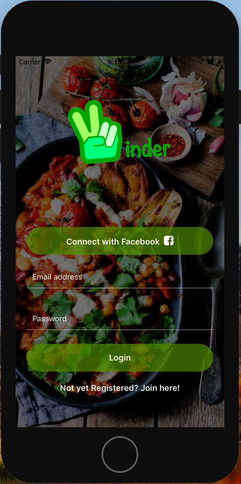
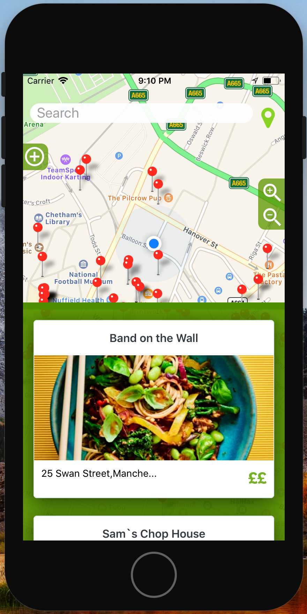
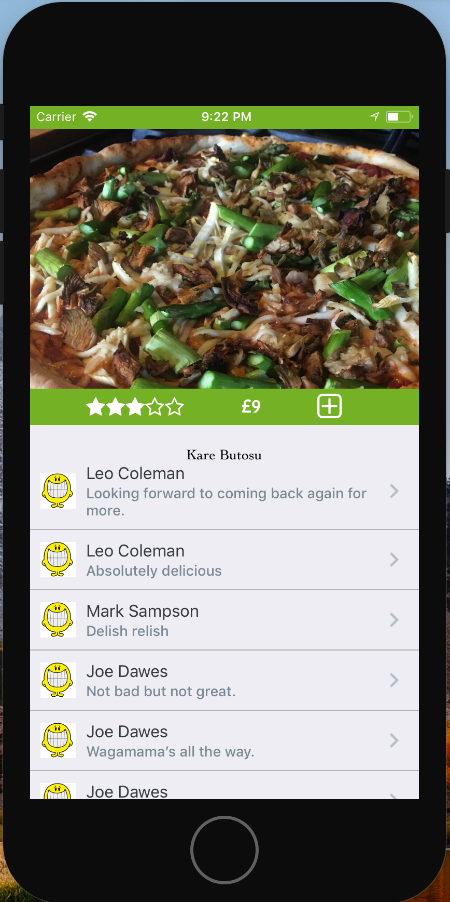

# Vinder

{:height="100px"}

### App for finding vegan meals in your area!
#

#### why?

This app was developed between 5 students on the northcoders bootcamp as a final project, with the aim of creating an app that allows users to join a community that can share their experiences in different restaurants. This avoids the need to scan through lists of blogs and websites full of out of date menus to find something you may potentially be able to sit down and enjoy!

#

Tech stack

- React native
- Google places api
- Google firebase
- AWS S3
- AWS RDS
- Facebook SDK

#

